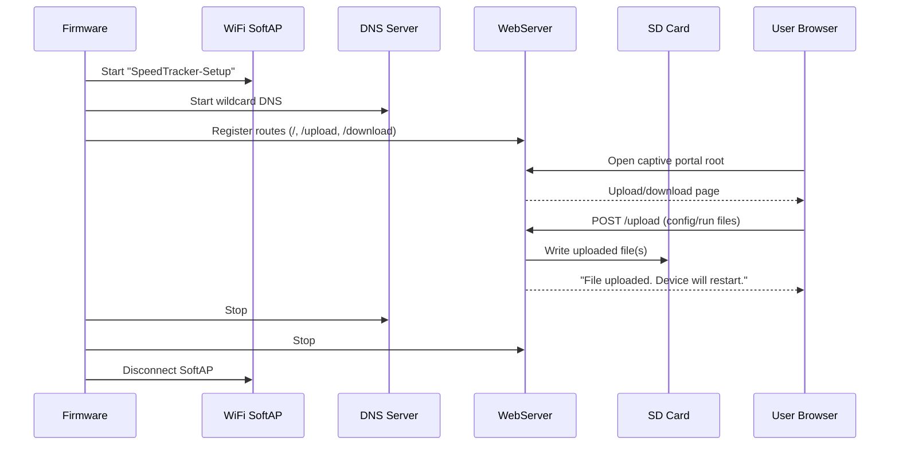

# SpeedTracker v4 Agent Context

## Project Summary
- Firmware project for ESP32-based LilyGo AMOLED hardware using Arduino + PlatformIO.
- UI is built with LVGL and presents a GPS speed tracker with runtime indicators.
- Device stores runtime/config files on SD and can enter a provisioning captive portal if required files are missing.

## Tech Stack
- Build system: PlatformIO (`platformio.ini`)
- Framework: Arduino (ESP32 platform)
- UI: LVGL
- Core hardware/libs: LilyGo AMOLED APIs, SparkFun u-blox GNSS, SD/FS, WiFi/WebServer/DNSServer

## Key Source Areas
- Entry point and orchestration: `/src/speedtracker.cpp`
- Core globals and shared types: `/src/speedtracker.h`
- GPS module and geofence logic: `/src/gps.cpp`, `/src/gps.h`
- Main UI (speedometer + LEDs + labels): `/src/display_MAIN.cpp`, `/src/display_MAIN.h`
- Provisioning UI + captive portal: `/src/display_PROVISION.cpp`, `/src/display_PROVISION.h`
- LVGL task wrapper: `/src/display.cpp`
- Device/build config: `/platformio.ini`, `/boards/T-Display-AMOLED.json`

## Runtime Architecture
```mermaid
flowchart LR
  A[setup() in speedtracker.cpp] --> B[Init I2C + AMOLED + LVGL]
  B --> C[Init SD card]
  C --> D{Config files exist?}
  D -- No --> E[Provisioning UI + Captive Portal]
  D -- Yes --> F[Initialize MAIN UI]
  E --> F
  F --> G[Initialize GPS]
  G --> H[deviceData.deviceInitialized=true]
  H --> I[loop()]
```

## Main Loop Data Flow
```mermaid
flowchart TD
  A[loop()] --> B[Check shutdown button]
  B --> C[Clear splash screen if needed]
  C --> D[gpsUpdateDisplayAndRunInfoData]
  D --> E[dispUpdateSpeedometer]
  E --> F{GPS fix >= 3?}
  F -- Yes --> G[Set GPS Fix LED + check finish-line polygon]
  F -- No --> H[Skip finish-line check]
  G --> I[Update sats/time/voltage labels]
  H --> I
  I --> J[dispTaskHandler -> lv_task_handler]
  J --> K[delay(nextTick)]
```

## Provisioning Flow


## Shared State to Know
- `initializationData`: subsystem init flags.
- `deviceData`: provisioning state and required SD file names.
- `gpsDisplayData`: live GPS/UI data, run logging state, and time fields.
- `sdCardPointer`: global pointer used by GPS/provisioning modules.

## Agent Notes for Future Work
- `loop()` must stay non-blocking to keep LVGL responsive (`dispTaskHandler` cadence is critical).
- Provisioning mode is entered when required SD files are missing.
- GPS run logging is tied to `gpsDisplayData.speedtrackingActive` (home button toggles this).
- Local environment may not have PlatformIO CLI preinstalled (`pio` command missing in this session).
